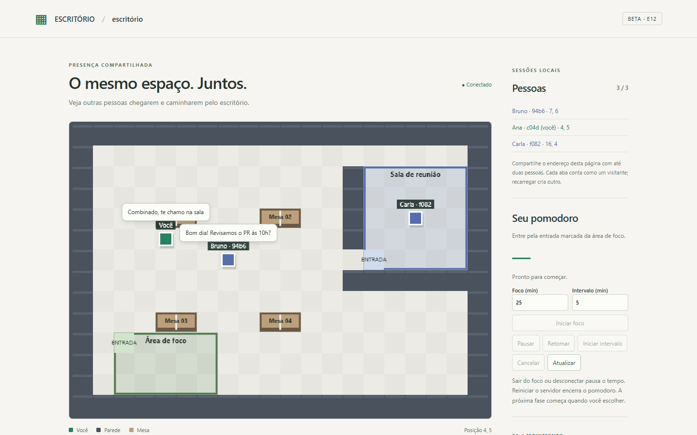
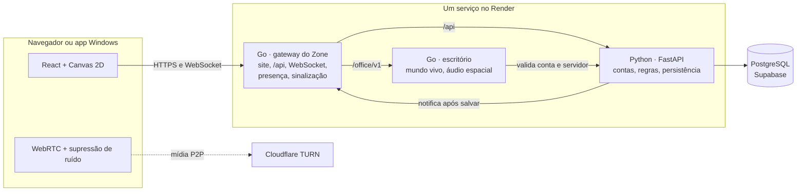
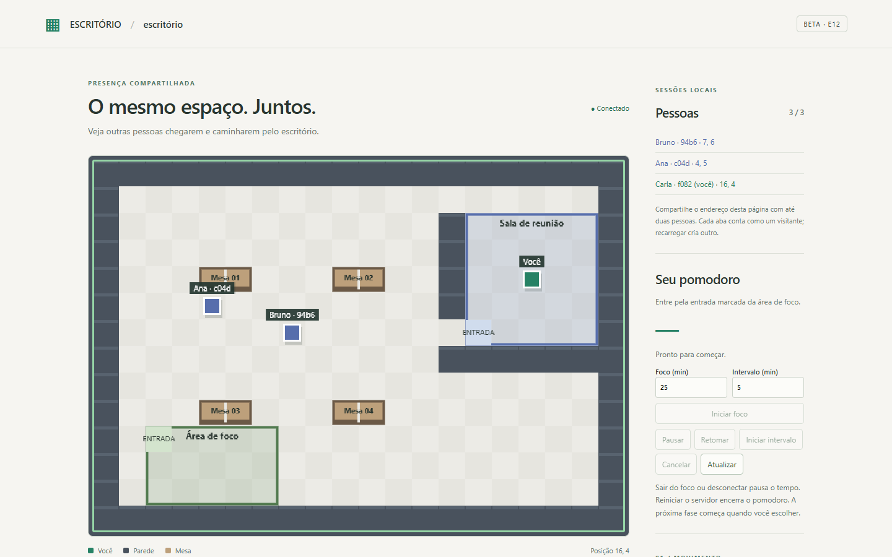

# Zone

### Chamadas de voz, chat e um escritório virtual 2D para equipes pequenas

**Python · Go · TypeScript/React · PostgreSQL · WebRTC · Canvas 2D**

Projeto pessoal, em uso real por um grupo de três pessoas, hospedado no Render
com TURN da Cloudflare e cliente para Windows.

> **Repositório vitrine.** O código completo é privado. Aqui estão a visão geral, as
> decisões de arquitetura, os problemas que enfrentei, os resultados medidos e
> [amostras reais do código](amostras/). Posso dar acesso de leitura ao repositório
> completo para avaliação técnica, é só pedir.

Escritório virtual com três pessoas. Ana e Bruno estão perto e se ouvem; os balões mostram o chat local. Carla está na sala de reunião e não recebe nada de fora.

---

## Sobre

O Zone começou como um lugar para eu e dois amigos conversarmos por texto e voz sem
depender de serviços grandes. Virou meu projeto de estudo de sistemas em tempo real:

- **Zone Call**: servidores, canais de texto com histórico e mensagens ao vivo,
  chamada de voz para até 3 pessoas, compartilhamento de tela, moderação e app Windows.
- **Escritório virtual**: um mapa 2D em grade onde a distância entre as pessoas
  define quem se ouve, com salas de reunião, áreas de foco, mesas, pomodoro e chat local.

Os dois são **módulos independentes**: o escritório abre dentro do Zone com a mesma
conta, mas também roda sozinho. Nenhum importa código do outro.

| | |
| --- | --- |
| Período | setembro e outubro de 2026, em etapas pequenas |
| Tamanho | cerca de 23 mil linhas de código e 30 mil linhas de testes |
| Testes | mais de 2.000 automatizados (Go, Python, Vitest e fluxos reais no navegador) |
| Hospedagem | Render (um único serviço), Supabase PostgreSQL, Cloudflare TURN |

## Funcionalidades

**Zone Call**

- Cadastro por convite e login que dura até 30 dias, com renovação automática e segura.
- Canais de texto com histórico paginado, mensagens ao vivo, presença e "digitando…".
- Chamada de voz WebRTC entre os participantes, funcionando entre redes diferentes.
- **Supressão de ruído com IA** no navegador: corta teclado, louça e respiração.
- Compartilhamento de tela com áudio opcional e troca de fonte sem sair da chamada.
- Controles pessoais (silenciar e volume só para mim) e de administrador
  (silenciar para todos, volume para todos, **remover da chamada**).
- **Jam do Spotify** compartilhado na chamada.
- App Windows (PySide6 + Qt WebEngine) com bandeja e navegação restrita ao Zone.

**Escritório virtual**

- Movimento em 4 direções validado no servidor (colisão, velocidade e ordem).
- Áudio espacial: o volume cai com a distância e paredes bloqueiam o som.
- Salas de reunião isoladas, áreas de foco só com texto e conversa "trancada" com consentimento.
- Mesas, pomodoro individual, chat local com balões e mensagens privadas.
- Convite de reunião que reserva uma sala e leva as duas pessoas juntas.

## Arquitetura

| Parte | Responsabilidade |
| --- | --- |
| Python (FastAPI) | Autenticação, autorização, regras de negócio, persistência, credenciais TURN temporárias |
| Go (gateway do Zone) | Porta pública: site, proxy da API, WebSocket autenticado, presença, distribuição de mensagens já salvas, sinalização da chamada |
| Go (escritório) | Estado autoritativo do mapa: posição, ocupação, quem ouve quem, reuniões |
| TypeScript | Interface, Canvas, captura e reprodução de mídia, supressão de ruído |

Princípios que guiaram as decisões:

- **Uma regra, um dono.** Python decide quem pode o quê; Go aplica ao vivo; o cliente
  só envia intenções ("andar para a direita"), nunca "estou em x, y".
- **Privacidade decidida no servidor.** Quem recebe áudio, tela ou texto é decidido no
  Go. Abaixar o volume no cliente não é isolamento.
- **Infraestrutura proporcional.** Sem Redis, filas ou servidor de mídia: para 3
  pessoas, P2P + TURN resolve e a mídia nunca passa pelo backend.
- **Módulos separáveis.** Zone Call e escritório conversam só por contrato
  HTTP/WebSocket; um script na regressão garante que nenhum importa o outro.

Mais detalhes, fluxos e decisões de segurança em [docs/arquitetura.md](docs/arquitetura.md).

## Problemas que enfrentei

| Problema | Como resolvi |
| --- | --- |
| A chamada caía entre redes diferentes (NAT) | TURN da Cloudflare com credenciais de curta duração emitidas pelo Python e renovadas durante a chamada, sem derrubar ninguém |
| Hospedagem gratuita que dorme após 15 min e limita tráfego | Tudo em um único serviço supervisionado; a mídia nunca atravessa o servidor |
| Login perdido a cada recarga | Sessão com cookie `HttpOnly` rotativo, só o hash no banco, e revogação da família inteira se um token antigo for reutilizado ([amostra](amostras/python/sessions_repo.py)) |
| Sinais WebRTC atrasados religavam áudio que deveria estar fechado | Gerações e IDs por sessão, contexto e transmissão; o que é antigo é descartado |
| Respiração, teclado e louça na chamada | Comparei RNNoise e GTCRN com medições; adotei GTCRN + um portão de voz próprio ([detalhes](docs/supressao-de-ruido.md)) |
| Janelas em segundo plano derrubavam a conexão (temporizadores reduzidos pelo navegador) | Ping/pong nativo do WebSocket e página mantida ativa no app Qt |
| Build do app Windows quebrava | O PyInstaller pegava uma DLL ICU incompatível do `PATH`; o build isola o `PATH` e testa o `.exe` gerado |
| Spotify não tem API pública de Jam | A chamada compartilha o convite, com validação estrita do link ([amostra](amostras/go/zone-call/jam.go)) |
| Microfone disputado entre chamada e escritório | Um árbitro de captura por janela, sem preempção ([amostra](amostras/typescript/captureArbiter.ts)) |

## Resultados

**Supressão de ruído** (medida em tempo real no Edge, nível nas pausas da fala):

| Ruído | Microfone | Com supressão |
| --- | --- | --- |
| Teclado mecânico | −41 dB | −58 dB |
| Respiração | −33 dB | −91 dB |
| Louça | −35 dB | −60 dB |

Nível da fala preservado e cerca de 36 ms de latência adicional.

**Qualidade**: cada etapa seguiu o mesmo ciclo: implementar, testar isolado, integrar,
rodar a regressão inteira e só avançar com tudo passando. Os testes de mídia conferem
pacotes RTP, energia do áudio decodificado e quadros de vídeo, não só ícones na tela.

| Módulo | Testes automatizados |
| --- | --- |
| Zone Call | 439 web (Vitest), 265 Go, 327 Python e integração com banco real |
| Escritório | 634 Go, 393 web, 43 Python com fluxos reais no Edge (áudio, tela, reuniões) |
| App Windows | testes isolados, WebRTC em segundo plano, perfil entre reinícios |

A mesma cena vista por Carla, na sala de reunião: os balões de quem está fora não chegam até ela.

## Amostras do código

Arquivos reais, copiados sem alteração além do cabeçalho. Veja o [guia das amostras](amostras/).

| Arquivo | O que mostra |
| --- | --- |
| [world.go](amostras/go/escritorio/world.go) | Movimento autoritativo: intenção, ordem, limite de velocidade e colisão |
| [policy.go](amostras/go/escritorio/policy.go) | Quem ouve quem: distância, salas, consentimento e linha de visão entre paredes |
| [policy_test.go](amostras/go/escritorio/policy_test.go) | Testes em tabela com verificação de simetria |
| [jam.go](amostras/go/zone-call/jam.go) | Validação estrita de URL, limite de taxa e estado ligado à chamada |
| [sessions_repo.py](amostras/python/sessions_repo.py) | Refresh token rotativo com detecção de reuso |
| [moderation_repo.py](amostras/python/moderation_repo.py) | Papéis e autorização no banco, com travas para edições concorrentes |
| [noiseSuppression.ts](amostras/typescript/noiseSuppression.ts) | Pipeline de áudio: AudioWorklet + WebAssembly com fallback |
| [voiceGate.worklet.js](amostras/typescript/voiceGate.worklet.js) | Portão de voz próprio (DSP) com piso de ruído adaptativo |
| [captureArbiter.ts](amostras/typescript/captureArbiter.ts) | Árbitro de microfone e tela compartilhado entre módulos |

## Stack

- **Backend**: Python 3.11+ (FastAPI, psycopg), PostgreSQL (Supabase); Go 1.22+ (gorilla/websocket)
- **Frontend**: React 18, TypeScript, Vite, Canvas 2D, Web Audio (AudioWorklet), WebRTC
- **Desktop**: PySide6 / Qt WebEngine, PyInstaller
- **Infra**: Docker multi-stage, Render, Cloudflare TURN
- **Testes**: Vitest, pytest, `go test`, fluxos reais no Edge via Chrome DevTools Protocol

## Próximos passos

- Visual do Zone Call: hoje a interface prioriza função e acessibilidade; o escritório já tem identidade visual própria.
- Servidor de mídia (SFU) se o grupo passar de 3 pessoas por chamada.
- Rodadas com microfones e redes reais de mais pessoas.

## Autor

**Ares**: [github.com/aresd-dev](https://github.com/aresd-dev)

Todos os direitos reservados; veja [LICENSE](LICENSE). Este repositório existe para
avaliação de portfólio.

---

<b>English summary</b>

Zone is a personal project in real use by a small group: a Discord-like app (text
channels, voice calls with screen sharing, AI noise suppression, moderation) plus a
Gather-like 2D virtual office where proximity decides who you hear. Python owns
accounts, rules and persistence; Go owns live connections, presence, WebRTC signaling
and the authoritative office world; TypeScript drives the UI, Canvas and media. It
runs in the browser and as a Windows app, hosted on Render with Cloudflare TURN.
About 23k lines of code and 30k lines of tests. This is a showcase repository: the
full source is private and available for technical review on request.

