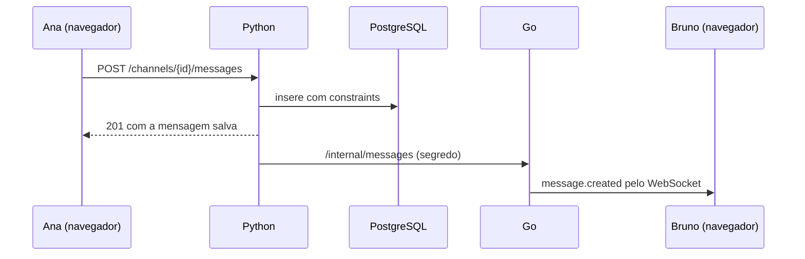
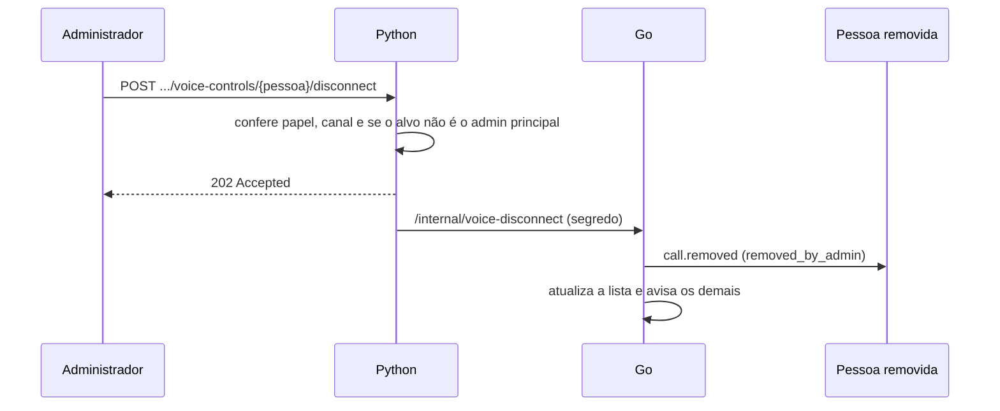

# Arquitetura do Zone

Visão técnica do sistema. O código completo é privado; trechos reais estão em
[amostras](../amostras/).

## Componentes e hospedagem

Em produção, tudo roda em **um único serviço do Render** (plano gratuito). Um
supervisor em Python inicia três processos no mesmo contêiner:

| Processo | Porta | Papel |
| --- | --- | --- |
| Go · gateway do Zone | pública | Serve o site, encaminha `/api` ao Python, mantém os WebSockets e encaminha `/office/v1` ao escritório |
| Python · FastAPI | loopback | Contas, regras, persistência no PostgreSQL, credenciais TURN |
| Go · escritório | loopback | Mundo vivo do escritório: posições, salas, áudio espacial, reuniões |

O gateway também abre uma porta privada só para o Python avisar, com segredo
compartilhado, que algo foi salvo. O banco é PostgreSQL no Supabase. A mídia das
chamadas vai direto entre as pessoas (P2P) ou pelo TURN da Cloudflare, e **nunca
passa pelo servidor**.

O build é um Dockerfile multi-stage: frontend do Zone, página e módulo do escritório,
dois binários Go e a imagem final com Python.

## Fluxos principais

### Mensagem de texto

O Python é a única fonte de verdade. O Go só distribui o que já foi salvo.

### Login persistente

- Senhas com bcrypt. O JWT de acesso dura 24 horas.
- O cookie de renovação é `HttpOnly`, `SameSite=Lax`, dura 30 dias e **troca a cada
  uso**. No banco fica só o hash.
- Duas abas renovando ao mesmo tempo recebem o mesmo sucessor por 30 segundos.
  Depois disso, reutilizar um token antigo revoga a sessão inteira, o que denuncia
  um token roubado.
- O WebSocket renova o JWT na mesma conexão (`auth.refresh`), sem derrubar a
  chamada, o rascunho ou o mute.

Código: [sessions_repo.py](../amostras/python/sessions_repo.py).

### Chamada de voz

1. O navegador pede ao Python a configuração de áudio do canal: servidores STUN/TURN
   e credenciais temporárias.
2. Pelo WebSocket, entra na chamada (`call.join`). O Go confere com o Python se a
   pessoa pode usar aquele canal de voz e mantém a lista de participantes.
3. As ofertas e respostas WebRTC trafegam pelo Go (`call.signal`), sempre com o ID
   da sessão de destino. Sinais de sessões antigas são descartados.
4. O áudio sai do microfone, passa pela supressão de ruído no navegador e segue
   direto para os outros participantes.

Trocar o nível de supressão substitui a faixa enviada (`replaceTrack`), sem reabrir
o microfone nem renegociar a conexão.

### Remover alguém da chamada

A pessoa pode entrar de novo; a remoção encerra a sessão atual, não bane.

### Escritório dentro do Zone

1. O Zone carrega em tempo de execução o módulo servido pelo escritório
   (`/office-embed`). O bundle do Zone não compila código do escritório.
2. Na entrada, o escritório recebe o JWT do Zone uma única vez, valida a conta e o
   vínculo com o servidor-escritório na API Python e troca por uma credencial própria.
3. A partir daí, o cliente só envia intenções: "andar para cima", "falar", "entrar
   na sala". O servidor valida ordem, velocidade, colisão e capacidade.
4. Para cada par de pessoas, o servidor decide se há texto, áudio e com qual volume,
   considerando distância, paredes, salas e conversas trancadas. Só os pares
   autorizados recebem a sinalização WebRTC.

Código: [world.go](../amostras/go/escritorio/world.go) e
[policy.go](../amostras/go/escritorio/policy.go).

## Fronteira entre os módulos

- Zone Call e escritório têm dependências, scripts e testes próprios.
- Comunicação só por contrato: HTTP (`/office/v1`), WebSocket e o módulo incorporável.
- Dois arquivos pequenos são compartilhados como **cópias idênticas** (supressão de
  ruído e portão de voz). Um script da regressão confere que continuam iguais e que
  nenhum módulo importa o outro.
- Microfone e tela são disputados por um árbitro comum na mesma janela:
  quem pegou primeiro fica, sem preempção
  ([captureArbiter.ts](../amostras/typescript/captureArbiter.ts)).

## Segurança

| Medida | Por quê |
| --- | --- |
| Cadastro só por convite e lista de contas autorizadas na hospedagem | Grupo pequeno e fechado |
| Origem permitida para CORS e WebSocket | Impede que outro site use a sessão |
| Endpoints internos com segredo gerado a cada inicialização | Só o Python avisa o Go |
| Credenciais TURN de curta duração, emitidas só para contas autorizadas | O token da Cloudflare nunca chega ao navegador |
| Segredos só em variáveis de ambiente, nada em `VITE_*` | O que vai para o navegador é público |
| App Windows restrito à origem do Zone | Links externos abrem no navegador do sistema |
| Validação estrita de entradas (URLs do Jam, IDs, tamanhos) | Nada do cliente é confiável |

## Decisões e trocas

| Decisão | Alternativa | Motivo |
| --- | --- | --- |
| P2P + TURN | Servidor de mídia (SFU) | Até 3 pessoas; zero custo de mídia no servidor |
| Um serviço supervisionado | Vários serviços | Plano gratuito e menos pontos de falha |
| Python para regras, Go para tempo real | Uma linguagem só | Cada uma no que faz melhor; o contrato entre elas fica explícito |
| Estado do escritório em memória no Go | Banco para posições | Posição muda várias vezes por segundo; só mesas e mensagens persistem |
| GTCRN no navegador | RNNoise ou supressão no servidor | Medido: reduz mais e distorce menos; a mídia não passa pelo servidor |
| Testes em navegador real via CDP | Só testes unitários | Mídia e WebRTC só se provam com pacotes e áudio de verdade |
